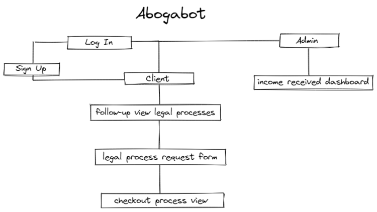
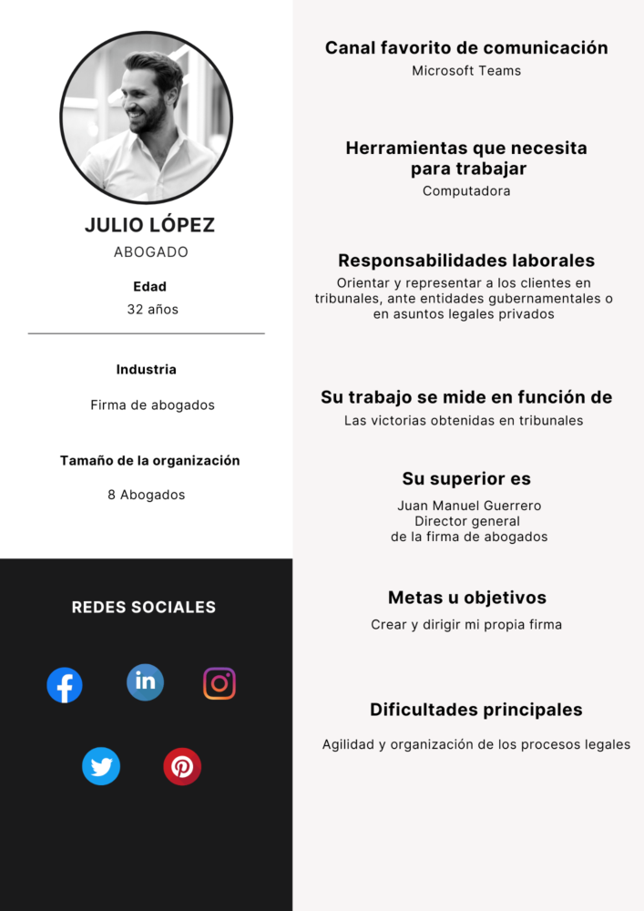
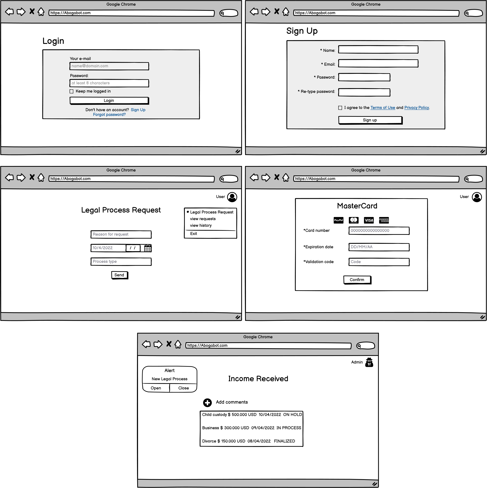
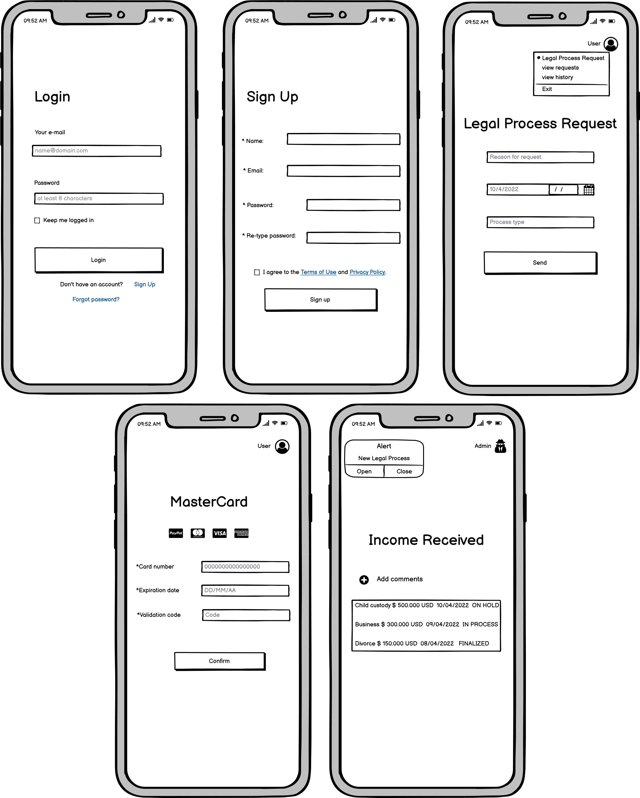
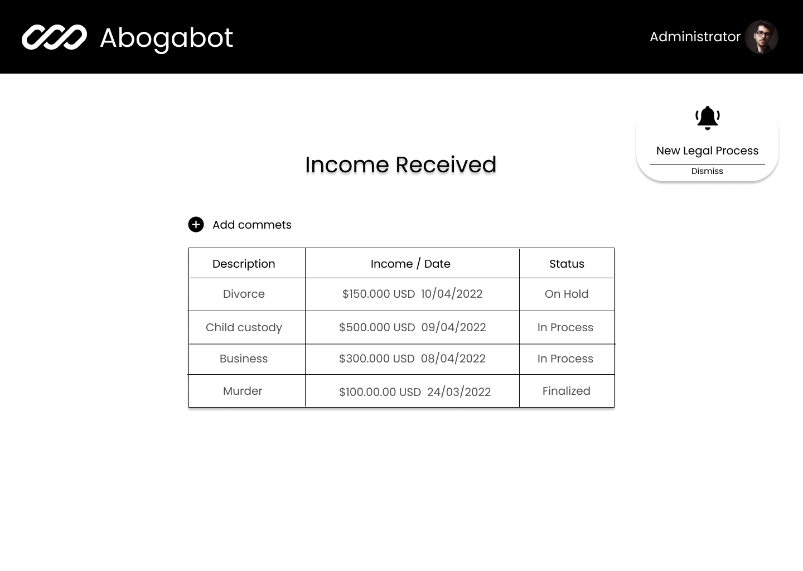

# ABOGABOT

## **1. Toma de requerimientos**

***Usuario Solicitante***

Solicitamos una Página web en la cual el cliente pueda crear su cuenta y ver el seguimiento de las actualizaciones del proceso legal y reciba correos de notificación de estos procesos. Además, Un formulario, Al momento de llenar este formulario se manda al proceso de pago para finalizar la transacción.

El administrador del sitio debe recibir una notificación de cada nueva demanda y con el formulario lleno
debe automáticamente crearse un documento legal en formato Word, Además el administrador podrá actualizar el proceso de la demanda y agregar comentarios en cada paso del proceso. 

En la plataforma debe haber un dashboard para ver los pagos y la cantidad de ingresos recibidos.

La plataforma debe ser responsive y los colores de preferencia para la página son azul marino y blanco, pero aceptamos propuestas diferentes.

***Lider Funcional***

Entiendo que debemos crear una plataforma responsive de color azul marino y blanco, En la cual los clientes puedan crear su cuenta, llenar un formulario del proceso legal, recibir correos de notificación de estos procesos y ver el seguimiento de sus demandas.

Debemos añadir un dashboard para ver los pagos y la cantidad de ingresos recibidos.

El administrador del sitio debe recibir notificaciones de cada nueva demanda y con el formulario lleno debe automáticamente crearse un documento legal en formato Word. Además, el administrador podrá actualizar el proceso de la demanda y agregar comentarios en cada paso del proceso.

## **Modelamiento de Negocio**

## **2. Buyer Persona**

## **3. Publico Objetivo**

## **3. UX**

## **Responsive UX**

## **4. UI**

***Log In***

***Sign Up***

***Legal process request form***

***Payment process***

***Administrator***

## **Responsive UI**

